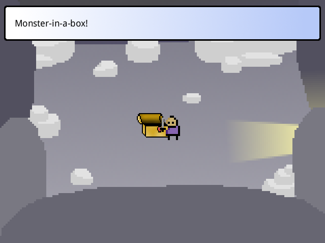
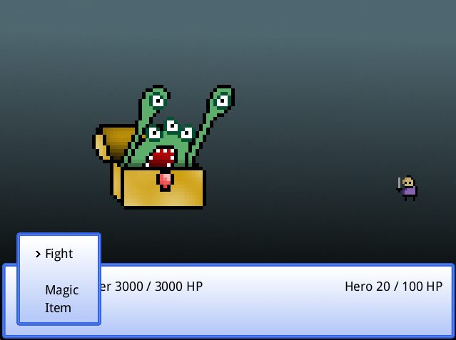

Treasure Chest Life - Ludum Dare 33
===

A failed entry for the Ludum Dare 33 compo.

Screenshots of the parts which work:

  

The inspiration
---

My plan was to reference the "Monster-in-a-box!" idiom from Final Fantasy. The theme for Ludum Dare 33 is "You are the Monster", so the twist is that you are a monster living inside a treasure chest and you're constantly getting attacked by the same group of adventurers who want to steal your treasure. You fight them in a traditional RPG style: fight, magic, items, run.

If you win ("Anihilated") or the adventurers run away, you gain some of the items which the adventurers were carrying ("A potion fell into the treasure chest!") and you put them in your treasure chest. You can then use those items during the next fight with the adventurers, after they grinded some more and came back stronger.

If you run away, the adventurers loot all of your items ("Obtained [list of all your remaining items]!" or "It's empty...") and the next fight will thus be harder.

If you lose, the adventurers loot all of your items and you get a save menu in which you can revert to a previous battle. It can be useful to go back to an earlier battle than the most recent one if you think you can manage to use fewer items.

After a predetermined number of fights, the adventurers give up, saying that they have more important things to do (like saving the world). The world is saved, peace is restored, and nobody ever comes bothering you in your treasure chest again, the end. If you ran away from the last fight, you get the bad ending: "But guarding an empty treasure chest is so lame... Try again?"

Post mortem
---

I spent a lot of time getting the animations to feel like the Final Fantasy games I remember playing as a kid. They look pretty good, but unfortunately that's all there is to it: a bunch of pretty animations, and no game.

In [my entry for Ludum Dare 31](https://github.com/gelisam/ludum-dare-31#readme), I wrote a custom animation library and it worked pretty well, but it [wasn't perfect](https://www.reddit.com/r/haskellgamedev/comments/2od4q2/its_ludum_dare_lets_show_them_what_haskell_can_do/cmohcmj). Hoping to do better this time, I wrote another custom animation library based on a slightly different design. I still think that design has potential, but I must have made a mistake somewhere in the implementation, because the resulting animations are quite unpredictable. After wasting too much time trying to fix the unpredictability, I decided to focus on the game, by working around the bugs of my library where I could. This was a slow and frustrating process, which is why I did not have the time to do anything else.

I guess the lesson for next time is to build these kinds of general purpose libraries ahead of time, except I was already well-aware of that lesson, which is why I started learning the engine and building the libraries I was missing two weeks ago. So I guess the real lesson is to start earlier than that :)
